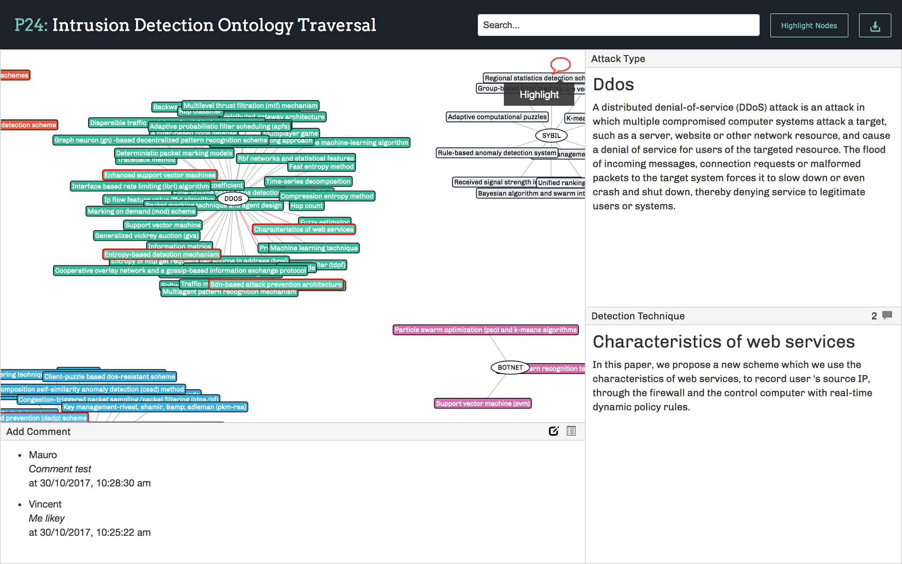

# GUI-Ontology-Traversal



## Setup
```
# clone this repository
git clone https://github.com/jdansev/GUI-Ontology-Traversal
# go into the directory
cd GUI-Ontology-Traversal
# start the server
python3 manage.py runserver
```

## To use
The web app is accessible in your browser at `127.0.0.1:8000`